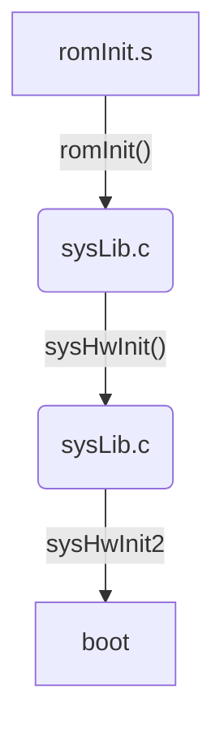

# vxWorks  研究

[TOC]


## vxworks介绍

## vxworks 的优点

vxworks 相对于其他嵌入式操作系统的优点：

1. 实时操作系统，用户程序执行效率高
2. 代码紧凑，编译后可执行镜像文件小
3. 开发环境友好，调试方便


## workbench 开发环境

workbench 编译 bsp 和 vip：需要 

1. bsp 源代码                      
   1.  WindRiver\vxworks-6.6\target\config\all
   2.  WindRiver\vxworks-6.6\target\config\simpc
2. wind 系统核心组件
   1. WindRiver\vxworks-6.6\target\lib\simpc\SIMNT\common
3. 额外组件
   1. WindRiver\components\obj\vxworks-6.6\krnl\lib\simpc\SIMNT\common

缺少组件，会出现无法链接错误。

系统头文件可以通过 eclipse 的 build 菜单添加：

project -> properties -> binary parser -> configure workspace settings -> wind river -> build -> build properties -> build paths

常用的工程

### 创建 BOOTROM 工程

BOOTROM建立的工程类型是 Creating Boot Loader/BSP Projects

### 创建 VIP 工程

vxworks 系统镜像的工程类型 Creating VxWorks Image Projects

### 开发与调试

## 目标板启动流程

## boot ROM 代码分析




### romInit

### bootInit

### usrConfig

## vxworks 核心代码分析

### wind 内核

#### task

#### tick

#### msg

#### kernel

#### sem

#### event

### os

#### io

#### cache

#### scsi

#### timer

#### tty

#### unixDrv

#### pipe

### 网络协议栈

#### netinet

##### ip

##### tcp

##### udp

#### netwrs

##### arp

##### dhcp

##### ftp

### VXVMI

### 中断与实时处理

### 驱动框架

#### 传统驱动开发

#### 基于 VxBus 驱动开发

### 应用开发

#### vxworks shell 常用命令：

##### 1．与任务相关的命令

sp ,[arg1],...,[arg9]
－启动任务，最多接受9个参数，默认的优先级100、堆栈20000字节

period n,,[arg1],...,[arg8]
－创建一个周期调用的任务，周期为n秒，最多接受8个参数

repeat m,,[arg1],...,[arg8]
－创建一个反复调用的任务，调用次数为m，m＝0时永久调用，最多也是8个参数

ts tidX         －挂起任务
tr tidX         －恢复挂起的任务
td tidX         －删除任务
i   tidX         －显示任务基本信息，参数为0时显示全部任务
ti tidX         －显示任务详细信息，包括寄存器、堆栈等
tt tidX         －显示任务的函数调用关系
checkStack tidX －显示任务堆栈使用的历史统计，参数为0时显示全部任务
[其中tidX可以为任务ID 也可以为任务名]

##### 2、系统信息

lkup ["string"] －在系统符号表中查找并列出含有"string"字符的函数及全局变量，有两个特殊参数：
​                   0，给出符号表统计；""（空字符串），列出全部符号

lkAddr addr      －显示addr地址附近的符号表

l addr,[n]       －显示addr地址开始的n条指令的反汇编，n省略时默认为10条指令

h [n]            －n为0时列出最近执行的shell命令，默认20条；n非0时，设定shell记录的历史命令的数目

d [addr,[number],[width]]
​                 －显示addr地址开始的number个单元的内容，width定制每个单元的宽度（字节），可以是1、2、4、8

（我们知道在shell下查看内存的用法:d Addr,UnitNum,UnitBytes  
  功能:从地址Addr开始显示UnitNum组的内存数据,每行显示16Bytes;每组包含UnitBytes字节,一行有16/UnitBytes   组数据; 
  说明:UnitBytes的可选值有:1,2,4,8;其它数值的显示形式和1相同.其中以1为参数可以从任意地址开始显示数据,  而已其它参数则只能从偶地址开始显示.） 

m addr,[width]   －按width宽度修改addr地址的内容，width可以是1、2、4、8

memShow 1        －显示系统分区上空闲和已分配空间的总数等

printErrno value －打印系统定义的错误码的宏

##### 3、与网络相关的命令

ifShow       ["ifname"]            - show info about network interfaces
inetstatShow                       - show all Internet protocol sockets
tcpstatShow                        - show statistics for TCP
udpstatShow                        - show statistics for UDP
ipstatShow                         - show statistics for IP
icmpstatShow                       - show statistics for ICMP
arpShow                            - show a list of known ARP entries
mbufShow                           - show network stack data pool statistics
netStackSysPoolShow                - show network stack system pool statistics

routeShow                          - display all IP routes (summary information)
mRouteShow                         - display all IP routes (verbose information)
routestatShow                      - display routing statistics
routeAdd     "destaddr","gateaddr" - add route to route table
routeDelete "destaddr","gateaddr" - delete route from route table

##### 4. 与文件操作命令

cd  "/tffs0/"

rm "flie"

rmdir "dir"

ls "/tffs0/",1

iosFdShow来显示文件描述符

说明：上述大多数命令都可以在help、netHelp中查到

##### 5. 启动应用

 loadModule的函数原型是：MODULE_ID loadModule( int fd, int loadFlag )。fd为文件描述符号，需要先打开文件获取fd；参数loadFlag含义有LOAD_NO_SYMBOLS（2）、LOAD_LOCAL_SYMBOLS（4）、LOAD_GLOBAL_SYMBOLS（8）、LOAD_ALL_SYMBOLS（0xC）三种。

  假如已经将需要加载的文件demo.o放到ram盘中，则加载到内存中的方式有以下几种：

(1)-> ld(1,0,”/tffs0/demo.o”)

(2)-> ld </tffs0/demo.o

(3)-> fd = open(“/tffs0/demo.o”,O_RDONLY);

  -> loadModule(fd,0xC);

  ->close(fd);

加载函数返回的是MODULE_ID，这是该加载模块的标识，使用卸载unldByModuleId时可以模块ID。查看加载模块的具体信息的函数是moduleShow()。

  对于某些应用，使用ld或loadModule会出现以下错误：

Relocation value does not fit in 24 bits.

ld error: error loading file (errno = 0x3d0001).

这个问题主要在内存空间大于32M，当往目标机上downloading编译好的模块时出现。 

例子：文件系统有个 hello.out

```c
ld(1,0,"hello.out")
lkup "main"
sp 0x108c0000
```


执行 application ：

```bash
rtpSp "helloworld.vxe"
```

##### 6. 应用信息

```shell
-> rtpShow

       NAME              ID          STATE      ENTRY ADDR  OPTIONS   TASK CNT
-------------------- ---------- --------------- ---------- ---------- --------
< bug/helloworld.vxe 0x104da670 STATE_NORMAL    0x130002d1       0x11        1

```


